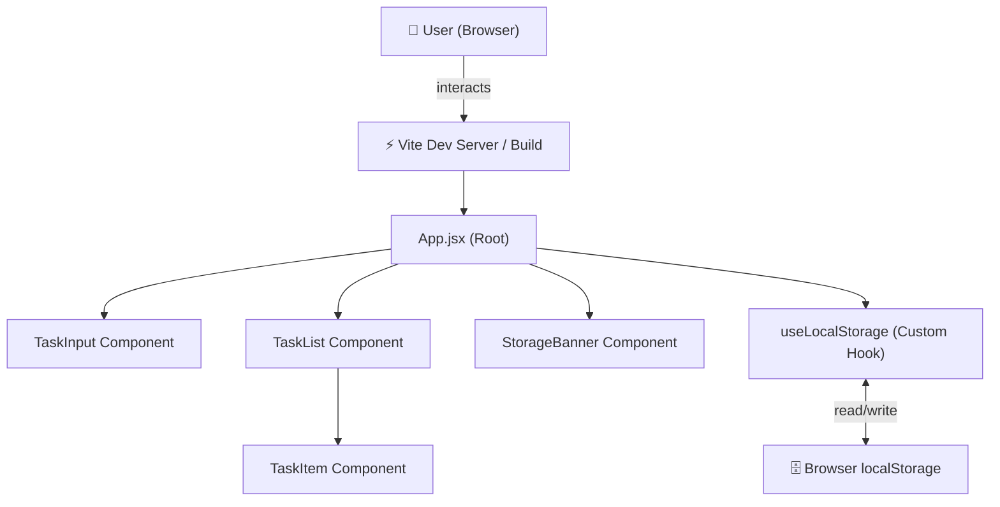
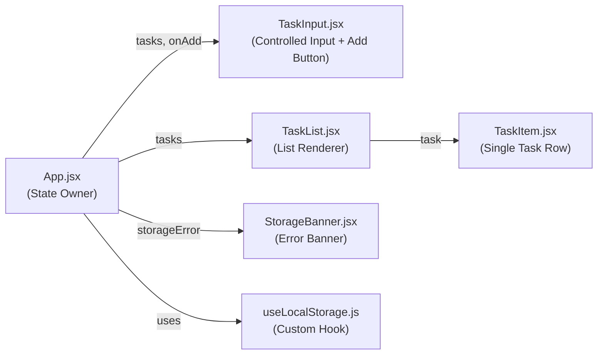
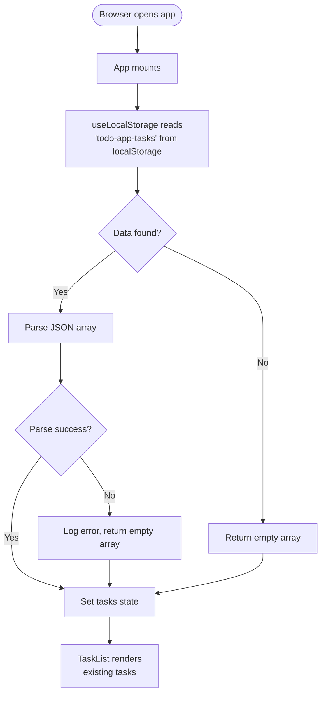
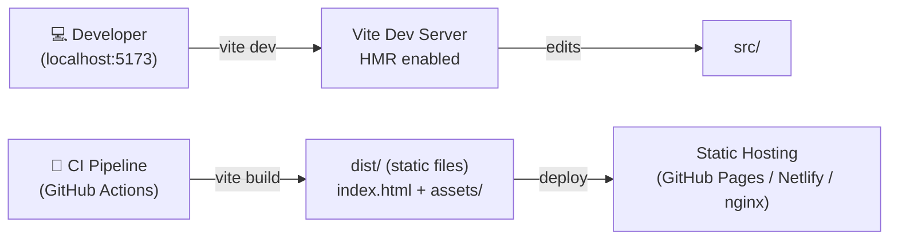

# Architecture: EPMCDMETST-43701 - To-Do-App

---

## 1. Executive Summary

The To-Do App is a single-page React application (SPA) that allows a single unauthenticated user to add tasks and persist them across browser sessions via localStorage. The architecture is deliberately lightweight: no backend, no authentication, no external APIs. The design prioritises fast load times, immediate UI feedback, and graceful degradation when localStorage is unavailable.

**Key Design Decisions:**
- React 18 with Vite for fast development and optimised production builds
- Functional components with hooks exclusively (`useState`, `useEffect`, custom hooks)
- Flat `src/components/` folder structure for simplicity
- `uuid` npm package for task ID generation
- Jest + React Testing Library for unit testing
- Inline warning banner for localStorage errors
- Tasks appended to the bottom of the list (chronological order)

---

## 2. Architecture Overview Diagram



---

## 3. Architectural Principles

- **Component-Based Architecture**: UI is decomposed into single-responsibility React components.
- **Separation of Concerns**: Storage logic is isolated in a custom hook (`useLocalStorage`), keeping components pure presentational/UI focused.
- **Unidirectional Data Flow**: State flows down via props; events bubble up via callbacks.
- **Graceful Degradation**: localStorage failures are caught and surfaced as non-blocking UI warnings; the app remains functional in-memory.
- **Progressive Enhancement**: Core functionality works without any build step; Vite enhances DX and bundle optimisation.
- **Fail-Safe Defaults**: Empty/whitespace input is blocked at the component level before any state update or storage write.

---

## 4. System Components

### Component Diagram



### Component Details

| Component | Responsibility | Technology | Dependencies |
|-----------|---------------|------------|--------------|
| `App.jsx` | Root state owner; orchestrates all child components | React 18 | `useLocalStorage`, all components |
| `TaskInput.jsx` | Controlled input field + disabled-aware Add button | React | None |
| `TaskList.jsx` | Renders ordered list of tasks | React | `TaskItem` |
| `TaskItem.jsx` | Renders a single task row | React | None |
| `StorageBanner.jsx` | Displays inline warning when localStorage fails | React | None |
| `useLocalStorage.js` | Reads/writes tasks to localStorage; surfaces errors | React hooks | `uuid` |

---

## 5. Technology Stack Rationale

### Frontend
| Technology | Choice | Rationale |
|------------|--------|-----------|
| UI Library | React 18 | Specified in requirements; hooks-first, large ecosystem |
| Build Tool | Vite 5 | Faster HMR than CRA, native ESM, optimised prod builds, actively maintained |
| Language | JavaScript (ES2022) | Sufficient for this scope; avoids TypeScript setup overhead |
| Styling | CSS Modules + design system conventions | Scoped styles, no class name conflicts, standard BEM-like naming |
| Task IDs | `uuid` (v4) | Deterministic uniqueness; well-tested npm package; spec requirement |

### Testing
| Technology | Choice | Rationale |
|------------|--------|-----------|
| Test Runner | Jest | Industry standard, integrates with Vite via `vitest` or `babel-jest` |
| Component Testing | React Testing Library | Tests user behaviour, not implementation details |
| Coverage | Istanbul (built into Jest) | Tracks coverage thresholds |

> **Note**: With Vite, prefer **Vitest** over Jest — it shares the Vite config, eliminates transform setup, and runs significantly faster. Architecture uses Vitest as the test runner.

### DevOps / Quality
| Tool | Purpose |
|------|---------|
| ESLint + `eslint-plugin-react` | Enforce React best practices |
| Prettier | Consistent code formatting |
| `vite build` | Production bundle (minified, tree-shaken) |

---

## 6. Data Flow Architecture

### Add Task Flow

```mermaid
flowchart TD
    A([User types in TaskInput]) --> B{Input empty\nor whitespace?}
    B -- Yes --> C[Add button stays disabled]
    B -- No --> D[Add button enabled]
    D --> E([User clicks Add or presses Enter])
    E --> F[App.handleAddTask called]
    F --> G[Generate uuid-v4 id]
    G --> H[Create task object:\n{id, text, createdAt}]
    H --> I[Append to tasks array]
    I --> J[useLocalStorage writes\nnew array to localStorage]
    J --> K{Write success?}
    K -- Yes --> L[TaskList re-renders\nwith new task appended]
    K -- No --> M[StorageBanner shows\nwarning message]
    M --> L
    L --> N[TaskInput clears]
```

### Page Load Flow



### State Management

```
App State (useState):
├── tasks: Task[]          — array of {id, text, createdAt}
├── inputValue: string     — controlled input value
└── storageError: string | null — error message for StorageBanner

Derived State (no extra state needed):
└── isAddDisabled: boolean  — inputValue.trim() === ''
```

---

## 7. API Design & Contracts

No external API. All data is client-side.

### localStorage Contract

| Key | Type | Description |
|-----|------|-------------|
| `todo-app-tasks` | `JSON string` | Serialised array of Task objects |

### Task Object Schema

```json
{
  "id": "550e8400-e29b-41d4-a716-446655440000",
  "text": "Buy groceries",
  "createdAt": "2026-05-26T07:09:00.000Z"
}
```

### Custom Hook Interface

```js
// useLocalStorage.js
const [tasks, setTasks, storageError] = useLocalStorage('todo-app-tasks', []);
// Returns: [currentValue, setter, errorMessage | null]
```

---

## 8. Database Architecture

No database. Browser localStorage is the sole persistence layer.

| Aspect | Detail |
|--------|--------|
| Storage Key | `todo-app-tasks` |
| Format | JSON-serialised array |
| Max Size | ~5MB (browser-enforced) |
| Scope | Origin-scoped (`localhost` or production domain) |
| Persistence | Survives page refresh; cleared by user or `localStorage.clear()` |

---

## 9. Security Architecture

| Concern | Approach |
|---------|---------|
| Authentication | None required (single-user, no login) |
| Input Sanitisation | Task text is stored as plain string; rendered via React (JSX auto-escapes, preventing XSS) |
| XSS Prevention | React's JSX rendering escapes all dynamic values by default — no `dangerouslySetInnerHTML` used |
| Data Sensitivity | Only task text stored; no PII, credentials, or sensitive data |
| CSRF | Not applicable — no server-side requests |
| localStorage Tampering | App validates parsed data shape on load; malformed data falls back to empty array |

> **OWASP Relevance**: A03 (Injection) is mitigated by React's auto-escaping. No other OWASP Top 10 items apply to this client-only scope.

---

## 10. Scalability & Performance Strategy

| Target | Approach |
|--------|---------|
| Initial load < 2s | Vite production build — code splitting, tree shaking, minification |
| Interaction < 100ms | React state updates are synchronous for UI; localStorage write is async-safe |
| Task list growth | Virtual list not required at this scope; revisit if > 500 tasks |
| Bundle size | No heavy dependencies — React + uuid only; total bundle target < 150KB gzipped |

### Performance Optimisations
- `React.memo` on `TaskItem` to avoid unnecessary re-renders when sibling tasks change
- `useCallback` on `handleAddTask` passed to `TaskInput`
- localStorage write batched inside `useEffect` (no write on every keystroke — only on task add)

---

## 11. Deployment Architecture



### Environment Strategy

| Environment | Command | URL |
|-------------|---------|-----|
| Development | `vite dev` | `http://localhost:5173` |
| Production Build | `vite build` | `dist/` static files |
| Preview Build | `vite preview` | `http://localhost:4173` |

### Folder Structure

```
To-Do-App/
├── public/
│   └── favicon.ico
├── src/
│   ├── components/
│   │   ├── TaskInput.jsx
│   │   ├── TaskInput.module.css
│   │   ├── TaskList.jsx
│   │   ├── TaskList.module.css
│   │   ├── TaskItem.jsx
│   │   ├── TaskItem.module.css
│   │   ├── StorageBanner.jsx
│   │   └── StorageBanner.module.css
│   ├── hooks/
│   │   └── useLocalStorage.js
│   ├── App.jsx
│   ├── App.module.css
│   └── main.jsx
├── tests/
│   ├── TaskInput.test.jsx
│   ├── TaskList.test.jsx
│   ├── TaskItem.test.jsx
│   └── useLocalStorage.test.js
├── index.html
├── vite.config.js
├── vitest.config.js
└── package.json
```

---

## 12. Monitoring & Observability

| Aspect | Approach |
|--------|---------|
| localStorage errors | Caught in `useLocalStorage`; surfaced via `StorageBanner` component |
| Console logging | `console.warn` for non-critical issues (storage parse errors) |
| Error boundaries | React `ErrorBoundary` wrapping `App` to catch unexpected render errors |
| Performance | Browser DevTools (Lighthouse) for load performance; no external monitoring needed at this scope |

---

## 13. Risk Assessment & Mitigation

| Risk | Likelihood | Impact | Mitigation |
|------|-----------|--------|-----------|
| localStorage unavailable (private/incognito mode) | Medium | Medium | Catch `SecurityError`; display `StorageBanner`; app works in-memory |
| localStorage quota exceeded | Low | Medium | Catch `QuotaExceededError`; show warning; prevent data loss |
| React version breaking change | Low | Low | Pin React 18.x in `package.json` |
| `uuid` package security advisory | Low | Low | Audit via `npm audit` in CI; trivial to replace with `crypto.randomUUID()` |
| Design system unavailable | Medium | High | Use placeholder CSS variables; design review agent to confirm tokens |

---

## 14. Technology Justification & Alternatives

| Decision | Chosen | Alternatives Considered | Rationale |
|----------|--------|------------------------|-----------|
| Build tool | Vite 5 | Create React App, Webpack | CRA is deprecated; Webpack requires more config; Vite is fastest for DX |
| Test runner | Vitest | Jest | Vitest shares Vite config — zero extra transform setup; faster cold start |
| Task IDs | `uuid` npm package | `crypto.randomUUID()`, `nanoid` | Specified in requirements; broad compatibility; well-known |
| Styling | CSS Modules | Tailwind, styled-components, Sass | CSS Modules are framework-agnostic, scoped, follow standard naming — no extra runtime |
| State | `useState` + `useEffect` | Redux, Zustand, Jotai | Complexity unwarranted for single-component state at this scope |
| Persistence | localStorage | IndexedDB, sessionStorage, backend | Specified in requirements; simplest fit for client-only persistence |

---

## Traceability Matrix

| Requirement | Architectural Decision |
|-------------|----------------------|
| FR-01, FR-02 | `TaskInput.jsx` — controlled input + button |
| FR-03 | `isAddDisabled` derived from `inputValue.trim() === ''` |
| FR-04 | React state update triggers immediate re-render of `TaskList` |
| FR-05 | `setInputValue('')` called after task append |
| FR-06, FR-07 | `useLocalStorage` custom hook |
| NFR (Performance) | Vite build, `React.memo`, `useCallback` |
| NFR (Reliability) | `try/catch` in `useLocalStorage`, `StorageBanner` |
| NFR (Security) | React JSX auto-escaping |

---

*Generated: 2026-05-26T07:20:00Z*
*Issue: https://jiraeu.epam.com/browse/EPMCDMETST-43701*
*Requires: outputs/requirements.md (EPMCDMETST-43701)*
