# Implementation Plan: EPMCDMETST-43701 - To-Do-App

---

## 1. Executive Summary

| Field | Detail |
|-------|--------|
| **Issue** | EPMCDMETST-43701 |
| **Application** | To-Do App — React 18 SPA |
| **Total Tasks** | 27 |
| **Total Effort** | ~40 hours |
| **Timeline** | 5 business days (with 1 developer) |
| **Critical Path** | 26 hours (Setup → Hook → Components → Integration → Tests → Deploy) |
| **Recommended Team** | 1–2 developers |
| **Buffer (20%)** | +8 hours |

### Key Phases & Milestones

| Phase | Name | Duration | Milestone |
|-------|------|----------|-----------|
| 1 | Project Setup & Foundation | 5h | Scaffold, lint, test config, CSS ready |
| 2 | Core Components | 12h | All components individually implemented |
| 3 | Integration | 4h | Fully wired, working app |
| 4 | Testing | 12h | ≥80% coverage, edge cases passing |
| 5 | Quality & Optimisation | 6h | Performance verified, a11y reviewed |
| 6 | Documentation & Deployment | 3h | README updated, dist/ deployed |

---

## 2. Implementation Approach

**Methodology:** Bottom-up, dependency-first. Build shared utilities (hook) before components; build leaf components (TaskItem) before parents (TaskList, App).

**Environment Setup Requirements:**
- Node.js ≥ 18.x
- npm ≥ 9.x
- Git configured
- VS Code (or equivalent) with ESLint + Prettier extensions

**Tools & Technologies:**

| Tool | Version | Purpose |
|------|---------|---------|
| React | 18.x | UI framework |
| Vite | 5.x | Build tool + dev server |
| Vitest | 1.x | Test runner |
| React Testing Library | 14.x | Component testing |
| uuid | 9.x | Task ID generation |
| ESLint | 8.x | Linting |
| Prettier | 3.x | Formatting |
| CSS Modules | (built-in) | Scoped styling |

**Quality Assurance Strategy:**
- ESLint with `react-hooks/exhaustive-deps` enforced — prevents useEffect bugs
- Vitest run on every commit (pre-commit hook recommended)
- No `dangerouslySetInnerHTML` — code review gate
- `React.memo` + `useCallback` added in Phase 5 after correctness verified

---

## 3. Task Breakdown by Category

| Category | Task Count | Estimated Hours |
|----------|-----------|-----------------|
| Setup & Foundation | 4 | 5h |
| Core Components | 7 | 12h |
| Integration | 3 | 4h |
| Testing | 6 | 12h |
| Quality & Optimisation | 4 | 6h |
| Documentation & Deployment | 3 | 3h |
| **Total** | **27** | **42h** |

---

## 4. Detailed Task List

| ID | Name | Description | Est. | Priority | Phase | Depends On | Status |
|----|------|-------------|------|----------|-------|-----------|--------|
| T-001 | Scaffold Vite + React project | Run `npm create vite@latest` with React template; verify dev server starts | 1h | High | 1 | — | Pending |
| T-002 | Configure ESLint + Prettier | Install `eslint-plugin-react`, `eslint-plugin-react-hooks`; create `.eslintrc.js` and `.prettierrc`; add lint script | 1h | High | 1 | T-001 | Pending |
| T-003 | Configure Vitest + RTL | Install `vitest`, `@testing-library/react`, `@testing-library/user-event`, `jsdom`; add `test` block to `vite.config.js`; add test scripts | 1h | High | 1 | T-001 | Pending |
| T-004 | Set up CSS Modules + design tokens | Create `src/styles/tokens.css` with design system CSS variables (colours, spacing, typography); verify CSS Modules work in a test component | 2h | High | 1 | T-001 | Pending |
| T-005 | Implement `useLocalStorage` hook | Create `src/hooks/useLocalStorage.js`; implement read on init, write on change, catch `SecurityError` and `QuotaExceededError`; return `[value, setValue, error]` | 3h | High | 2 | T-001 | Pending |
| T-006 | Implement `ErrorBoundary` component | Create `src/components/ErrorBoundary.jsx`; class component with `componentDidCatch`; render fallback UI on error | 1h | High | 2 | T-004 | Pending |
| T-007 | Implement `StorageBanner` component | Create `src/components/StorageBanner.jsx` + CSS Module; renders inline warning banner when `storageError` prop is non-null; dismissible | 1h | High | 2 | T-004 | Pending |
| T-008 | Implement `TaskItem` component | Create `src/components/TaskItem.jsx` + CSS Module; renders single task row with `task.text`; accepts `task` prop | 1h | High | 2 | T-004 | Pending |
| T-009 | Implement `TaskList` component | Create `src/components/TaskList.jsx` + CSS Module; renders `<ul>` of `TaskItem` components; accepts `tasks` array prop; handles empty state | 1h | High | 2 | T-008 | Pending |
| T-010 | Implement `TaskInput` component | Create `src/components/TaskInput.jsx` + CSS Module; controlled input; `Add` button disabled when `value.trim() === ''`; `onAdd` callback prop; `onKeyDown` Enter support | 2h | High | 2 | T-004 | Pending |
| T-011 | Implement `App.jsx` | Create `src/App.jsx`; own `tasks`, `inputValue`, `storageError` state; implement `handleAddTask` (uuid generation, append, clear input); wire `useLocalStorage`; render all child components | 3h | High | 2 | T-005, T-006, T-007, T-009, T-010 | Pending |
| T-012 | Wire `main.jsx` with `ErrorBoundary` | Update `src/main.jsx` to wrap `<App />` in `<ErrorBoundary>`; verify full app renders | 1h | High | 3 | T-011 | Pending |
| T-013 | Validate localStorage read on mount | Confirm `useLocalStorage` loads existing tasks on app mount; test with pre-seeded localStorage in browser DevTools | 1h | High | 3 | T-012 | Pending |
| T-014 | End-to-end manual smoke test | Manually verify all 7 ACs in Chrome: add task, Enter key, disabled button, input clear, persistence on refresh, empty-state load | 2h | High | 3 | T-012 | Pending |
| T-015 | Unit tests — `useLocalStorage` | Test: init from localStorage, write on change, SecurityError fallback, QuotaExceededError fallback, malformed JSON fallback | 2h | High | 4 | T-005 | Pending |
| T-016 | Unit tests — `TaskInput` | Test: renders input + button; button disabled when empty; button enabled on input; calls `onAdd` on click; calls `onAdd` on Enter; does not call `onAdd` on empty | 2h | High | 4 | T-010 | Pending |
| T-017 | Unit tests — `TaskList` + `TaskItem` | Test: renders N TaskItems for N tasks; renders empty state when tasks=[]; TaskItem displays correct text | 2h | Medium | 4 | T-009, T-008 | Pending |
| T-018 | Unit tests — `StorageBanner` | Test: not rendered when `storageError` is null; renders warning text when error set; dismissible | 1h | Medium | 4 | T-007 | Pending |
| T-019 | Unit tests — `App.jsx` | Test: full add-task flow; input clears after add; task appears in list; storageError triggers banner; tasks load from mocked localStorage on mount | 3h | High | 4 | T-011 | Pending |
| T-020 | Edge case tests | Test: whitespace-only input blocked; duplicate task text allowed; very long task text (500 chars); rapid multiple adds; localStorage pre-populated with invalid JSON | 2h | Medium | 4 | T-015, T-016, T-019 | Pending |
| T-021 | Add `React.memo` + `useCallback` | Wrap `TaskItem` in `React.memo`; wrap `handleAddTask` in `useCallback` in `App.jsx`; verify no regressions in tests | 1h | Medium | 5 | T-020 | Pending |
| T-022 | Performance validation | Run Lighthouse on prod build; verify load < 2s; verify bundle < 150KB gzip; run `vite build` and inspect output | 2h | Medium | 5 | T-021 | Pending |
| T-023 | Browser compatibility check | Test app in latest 2 versions of Chrome, Firefox, Safari, Edge; verify all ACs pass in each | 2h | Medium | 5 | T-021 | Pending |
| T-024 | Accessibility review | Verify: input has `aria-label`; button has descriptive text; task list is a `<ul>` with `<li>` items; keyboard nav works; colour contrast passes WCAG AA | 1h | Medium | 5 | T-021 | Pending |
| T-025 | Update README | Document: project overview, prerequisites, setup steps (`npm install`, `npm run dev`), test command, build command, localStorage key | 1h | Low | 6 | T-022 | Pending |
| T-026 | Production build verification | Run `npm run build`; serve `dist/` with `vite preview`; re-verify all 7 ACs on production build | 1h | High | 6 | T-022 | Pending |
| T-027 | Deploy to static hosting | Deploy `dist/` to GitHub Pages or equivalent; verify live URL; confirm localStorage works on production domain | 1h | Medium | 6 | T-026 | Pending |

---

## 5. Dependency Analysis

### Dependency Matrix

```
T-001 ──┬── T-002
        ├── T-003
        ├── T-004 ──┬── T-006
        │           ├── T-007 ── T-018
        │           ├── T-008 ──┬── T-009 ──┐
        │           │           └── T-017    │
        │           └── T-010 ── T-016       │
        └── T-005 ──────────────────────── T-011 ── T-012 ──┬── T-013
                                            ↑               ├── T-014
                                     T-009──┘               └── T-019 ──┐
                                     T-010──┘                           │
                                     T-006──┘                           ↓
                                     T-007──┘              T-015, T-016, T-017,
                                                           T-018, T-020
                                                                ↓
                                                           T-021 ──┬── T-022 ──┬── T-025
                                                                   ├── T-023   ├── T-026 ── T-027
                                                                   └── T-024   └── ...
```

### Critical Path

```
T-001 (1h) → T-004 (2h) → T-005 (3h) → T-011 (3h) → T-012 (1h)
→ T-014 (2h) → T-019 (3h) → T-020 (2h) → T-021 (1h)
→ T-022 (2h) → T-026 (1h) → T-027 (1h)

Total Critical Path: ~22 hours
```

### Parallel Work Opportunities

| Parallel Group | Tasks | When |
|---------------|-------|------|
| Group A | T-002, T-003, T-004 | All start after T-001 |
| Group B | T-006, T-007, T-008, T-010 | All start after T-004 (no inter-deps) |
| Group C | T-005 | Starts after T-001, independent of T-004 group |
| Group D | T-015, T-016, T-017, T-018 | Run in parallel after respective components |
| Group E | T-022, T-023, T-024 | All start after T-021 |
| Group F | T-025 | Runs in parallel with T-022/T-023/T-024 |

---

## 6. Implementation Phases

### Phase 1: Project Setup & Foundation (5h)

| Task | Duration | Deliverable |
|------|----------|-------------|
| T-001 | 1h | Vite + React project running on localhost:5173 |
| T-002 | 1h | ESLint + Prettier enforced; `npm run lint` works |
| T-003 | 1h | Vitest configured; `npm run test` runs (0 tests, passes) |
| T-004 | 2h | CSS token file; first CSS Module component verified |

**Phase 1 Exit Criteria:**
- `npm run dev` starts without errors
- `npm run lint` passes
- `npm run test` runs successfully
- CSS Modules scope confirmed working

---

### Phase 2: Core Components (12h)

| Task | Duration | Deliverable |
|------|----------|-------------|
| T-005 | 3h | `useLocalStorage` hook — read/write/error handling |
| T-006 | 1h | `ErrorBoundary.jsx` — catches render errors |
| T-007 | 1h | `StorageBanner.jsx` — conditional warning banner |
| T-008 | 1h | `TaskItem.jsx` — single task row |
| T-009 | 1h | `TaskList.jsx` — list renderer with empty state |
| T-010 | 2h | `TaskInput.jsx` — controlled input, disabled button, Enter key |
| T-011 | 3h | `App.jsx` — full state orchestration, task creation |

**Phase 2 Exit Criteria:**
- Each component renders in isolation without errors
- `useLocalStorage` reads/writes/catches errors correctly
- `App.jsx` renders with all children visible

---

### Phase 3: Integration (4h)

| Task | Duration | Deliverable |
|------|----------|-------------|
| T-012 | 1h | `main.jsx` wired with `ErrorBoundary` |
| T-013 | 1h | localStorage read on mount confirmed |
| T-014 | 2h | All 7 ACs manually verified in Chrome |

**Phase 3 Exit Criteria:**
- All 7 Acceptance Criteria pass manually in Chrome
- localStorage persistence confirmed across page refresh
- StorageBanner visible when localStorage blocked

---

### Phase 4: Testing (12h)

| Task | Duration | Deliverable |
|------|----------|-------------|
| T-015 | 2h | `useLocalStorage` unit tests — all branches covered |
| T-016 | 2h | `TaskInput` unit tests — disabled state, onAdd, Enter key |
| T-017 | 2h | `TaskList` + `TaskItem` unit tests |
| T-018 | 1h | `StorageBanner` unit tests |
| T-019 | 3h | `App.jsx` integration tests — full add-task flow |
| T-020 | 2h | Edge case tests — whitespace, long text, invalid JSON |

**Phase 4 Exit Criteria:**
- `npm run test` passes with ≥80% line coverage
- All edge cases (whitespace, quota error, invalid JSON) tested and passing
- No console errors in test output

---

### Phase 5: Quality & Optimisation (6h)

| Task | Duration | Deliverable |
|------|----------|-------------|
| T-021 | 1h | `React.memo` on `TaskItem`; `useCallback` on `handleAddTask` |
| T-022 | 2h | Lighthouse score ≥90; bundle < 150KB gzip confirmed |
| T-023 | 2h | App verified in Chrome, Firefox, Safari, Edge (latest 2) |
| T-024 | 1h | ARIA labels, keyboard nav, WCAG AA colour contrast verified |

**Phase 5 Exit Criteria:**
- Lighthouse performance score ≥90
- Bundle gzip ≤150KB
- All ACs pass in all 4 browsers
- No accessibility violations (axe DevTools)

---

### Phase 6: Documentation & Deployment (3h)

| Task | Duration | Deliverable |
|------|----------|-------------|
| T-025 | 1h | README with setup, scripts, localStorage key documented |
| T-026 | 1h | `dist/` production build verified; all ACs pass |
| T-027 | 1h | App live on static host; production URL confirmed |

**Phase 6 Exit Criteria:**
- `npm run build` completes without errors
- Production URL accessible
- All 7 ACs pass on production deployment

---

## 7. Timeline & Effort Estimate

### With 1 Developer (Sequential + some parallel)

| Day | Tasks | Hours |
|-----|-------|-------|
| Day 1 | T-001, T-002, T-003, T-004, T-005 | 8h |
| Day 2 | T-006, T-007, T-008, T-009, T-010, T-011 | 9h |
| Day 3 | T-012, T-013, T-014, T-015, T-016 | 8h |
| Day 4 | T-017, T-018, T-019, T-020, T-021 | 9h |
| Day 5 | T-022, T-023, T-024, T-025, T-026, T-027 | 8h |

**Total: ~42h | Timeline: 5 business days**
**With 20% buffer: ~50h | Timeline: 6–7 business days**

### With 2 Developers (Parallel tracks)

| Day | Dev 1 | Dev 2 |
|-----|-------|-------|
| Day 1 | T-001, T-002, T-003 | T-004, T-005 |
| Day 2 | T-006, T-007, T-010 | T-008, T-009, T-011 |
| Day 3 | T-012, T-013, T-014, T-015 | T-016, T-017, T-018 |
| Day 4 | T-019, T-020, T-021 | T-022, T-023 |
| Day 5 | T-024, T-025, T-026, T-027 | Code review + bug fixes |

**Total: ~3.5 business days with 2 developers**

---

## 8. Parallel Work Opportunities

```mermaid
gantt
    title Implementation Timeline (1 Developer)
    dateFormat  HH
    axisFormat %Hh

    section Phase 1
    T-001 Scaffold           :t001, 00, 1h
    T-002 ESLint             :t002, after t001, 1h
    T-003 Vitest             :t003, after t001, 1h
    T-004 CSS Tokens         :t004, after t001, 2h

    section Phase 2
    T-005 useLocalStorage    :t005, after t004, 3h
    T-006 ErrorBoundary      :t006, after t004, 1h
    T-007 StorageBanner      :t007, after t004, 1h
    T-008 TaskItem           :t008, after t004, 1h
    T-009 TaskList           :t009, after t008, 1h
    T-010 TaskInput          :t010, after t004, 2h
    T-011 App.jsx            :t011, after t005, 3h

    section Phase 3
    T-012 main.jsx           :t012, after t011, 1h
    T-013 Mount test         :t013, after t012, 1h
    T-014 Smoke test         :t014, after t012, 2h
```



---

## 9. Blocked Tasks

No tasks are externally blocked at plan creation time.

| Potential Blocker | Affected Tasks | Risk | Mitigation |
|------------------|---------------|------|-----------|
| Design system tokens not finalised | T-004 | Medium | Use placeholder CSS variables; update once tokens confirmed |
| Node.js not installed | T-001 | Low | Document prerequisite; dev should install Node ≥18 |
| Browser unavailable (Safari on Windows) | T-023 | Low | Use BrowserStack or ask macOS user for Safari verification |

---

## 10. Risk Assessment

| Risk | Affected Tasks | Severity | Mitigation |
|------|---------------|----------|-----------|
| `useEffect` dependency bugs | T-005, T-011, T-015 | Medium | ESLint `react-hooks/exhaustive-deps` enforced (T-002) |
| localStorage unavailable in test env | T-015, T-020 | Medium | Mock `localStorage` with `vi.stubGlobal` in Vitest |
| CSS Modules class name collisions | T-004–T-010 | Low | CSS Modules prevent collisions by design |
| Bundle exceeds 150KB | T-022 | Low | No heavy dependencies; uuid is ~3KB; React ~45KB gzip |
| Safari-specific localStorage behaviour | T-023 | Low | Test explicitly; add try/catch covers this already |
| Design tokens not available | T-004 | Medium | Start with CSS custom properties as placeholders |

---

## 11. Resource Allocation

| Role | Skills Required | Tasks | Effort |
|------|----------------|-------|--------|
| Frontend Developer | React 18, Vite, CSS Modules, Vitest | T-001 to T-027 | 40h |
| (Optional) QA Engineer | Browser testing, accessibility tools | T-023, T-024 | 3h |

**Minimum viable team:** 1 React developer.

---

## 12. Success Criteria & Quality Gates

### Definition of Done (per task)
- Code written and manually verified
- `npm run lint` passes (no new errors)
- `npm run test` passes (no regressions)
- Code reviewed (self-review minimum; peer review recommended)

### Phase Quality Gates

| Phase | Gate |
|-------|------|
| Phase 1 | Dev server starts; lint + test commands work |
| Phase 2 | Each component renders in isolation; no console errors |
| Phase 3 | All 7 ACs pass manually in Chrome |
| Phase 4 | ≥80% test coverage; all edge cases pass |
| Phase 5 | Lighthouse ≥90; bundle ≤150KB; cross-browser verified |
| Phase 6 | Production URL live; all 7 ACs pass on prod |

### Code Review Checklist
- [ ] No `dangerouslySetInnerHTML`
- [ ] All user-facing strings are escaped by React (no raw DOM manipulation)
- [ ] `useEffect` dependency arrays reviewed
- [ ] `localStorage` key uses namespace `todo-app:tasks`
- [ ] `maxLength` attribute on `TaskInput` input field (≤500 chars)
- [ ] `uuid` used only in `App.jsx` — not in `useLocalStorage`
- [ ] `ErrorBoundary` wraps `<App>` in `main.jsx`

---

## 13. Testing Strategy

### Unit Test Coverage Targets

| File | Target Coverage | Key Scenarios |
|------|----------------|--------------|
| `useLocalStorage.js` | 100% | Init, write, SecurityError, QuotaExceededError, JSON parse error |
| `TaskInput.jsx` | 100% | Disabled state, onAdd callback, Enter key, whitespace |
| `TaskList.jsx` | 90% | Empty state, N tasks rendered |
| `TaskItem.jsx` | 90% | Text rendered correctly |
| `StorageBanner.jsx` | 100% | Null = hidden, error = visible, dismiss |
| `App.jsx` | 85% | Full add flow, state updates, localStorage mock |

### Edge Case Test Scenarios

| Scenario | Expected Behaviour |
|----------|------------------|
| Empty input submit (click) | Button disabled — no action |
| Whitespace-only input (`"   "`) | Button disabled — trimmed = empty |
| Enter key on empty input | No action |
| Enter key on valid input | Task added, input cleared |
| Task text = 500 chars | Accepted and rendered |
| localStorage `SecurityError` | StorageBanner shown; task in memory only |
| localStorage `QuotaExceededError` | StorageBanner shown; existing tasks unaffected |
| Pre-existing valid JSON in localStorage | Tasks rendered on load |
| Pre-existing malformed JSON in localStorage | Empty list; no crash |
| Rapid successive adds | Each task gets unique uuid; all persisted |

### Browser Compatibility Matrix

| Browser | Version | Test Method |
|---------|---------|-------------|
| Chrome | Latest 2 | Manual + Lighthouse |
| Firefox | Latest 2 | Manual |
| Safari | Latest 2 | Manual (macOS) or BrowserStack |
| Edge | Latest 2 | Manual |

---

## 14. Dependencies & Prerequisites

### Tool Setup
- [ ] Node.js ≥18.x installed (`node --version`)
- [ ] npm ≥9.x installed (`npm --version`)
- [ ] Git configured (`git config --global user.name`)
- [ ] VS Code with ESLint + Prettier extensions (recommended)

### npm Packages to Install
```bash
# Production dependencies
npm install react react-dom uuid

# Dev dependencies
npm install -D vite @vitejs/plugin-react
npm install -D vitest @vitest/coverage-v8 jsdom
npm install -D @testing-library/react @testing-library/user-event @testing-library/jest-dom
npm install -D eslint eslint-plugin-react eslint-plugin-react-hooks
npm install -D prettier
```

### package.json Scripts
```json
{
  "scripts": {
    "dev": "vite",
    "build": "vite build",
    "preview": "vite preview",
    "test": "vitest",
    "test:coverage": "vitest run --coverage",
    "lint": "eslint src --ext .js,.jsx",
    "format": "prettier --write src"
  }
}
```

### vite.config.js (includes Vitest)
```js
import { defineConfig } from 'vite'
import react from '@vitejs/plugin-react'

export default defineConfig({
  plugins: [react()],
  test: {
    globals: true,
    environment: 'jsdom',
    setupFiles: './tests/setup.js',
    coverage: {
      provider: 'v8',
      threshold: { lines: 80 }
    }
  }
})
```

---

## 15. Assumptions & Constraints

| Assumption | Detail |
|-----------|--------|
| Team size | 1 developer (plan scales to 2) |
| Work hours | 8 hours/day |
| Developer skill level | Mid-level React developer |
| Design tokens | CSS variables to be confirmed with design team; placeholders used initially |
| No IE11 support | Confirmed in requirements — latest 2 browser versions only |
| Task management features out of scope | Complete, delete, edit tasks NOT in this story |
| No backend | Client-only; no API calls |
| No TypeScript | Plain JavaScript for this story |

---

## 16. Next Steps (Day 1 Actions)

### Immediate Actions
1. **Clone / initialise repository** — ensure git is configured
2. **Run T-001** — `npm create vite@latest todo-app -- --template react`
3. **Run T-002 + T-003 in parallel** — install ESLint, Prettier, Vitest; configure
4. **Confirm design system tokens** — get CSS variables from design team before T-004
5. **Start T-005** — `useLocalStorage` hook is the most critical shared utility

### Team Kickoff Agenda
- [ ] Review `outputs/requirements.md` — understand all 7 ACs
- [ ] Review `outputs/architecture.md` — understand component structure
- [ ] Review `outputs/architecture-review.md` — understand approved decisions + constraints
- [ ] Review this plan — agree on task ownership
- [ ] Set up local environment (Node, git, VS Code)
- [ ] Begin Phase 1

### First Sprint (Day 1–2)
Complete Phase 1 (Setup) + Phase 2 (Components). By end of Day 2, all components should exist individually and render without errors.

---

## Traceability: Tasks → Requirements

| Requirement | Implementation Tasks |
|-------------|---------------------|
| FR-01 (input field) | T-010 |
| FR-02 (Add button) | T-010 |
| FR-03 (button disabled) | T-010, T-016 |
| FR-04 (immediate render, no reload) | T-011, T-019 |
| FR-05 (input clears) | T-011, T-019 |
| FR-06 (localStorage persist) | T-005, T-015 |
| FR-07 (load on mount) | T-005, T-013, T-015 |
| NFR (Performance) | T-021, T-022 |
| NFR (Security) | T-002 (ESLint), T-024 |
| NFR (Reliability) | T-005, T-015, T-020 |
| All ACs | T-014 (smoke), T-019 (integration), T-026 (prod) |

---

*Generated: 2026-05-26T07:45:00Z*
*Issue: https://jiraeu.epam.com/browse/EPMCDMETST-43701*
*Requires: outputs/architecture.md (3df2816), outputs/architecture-review.md (3df2816)*
